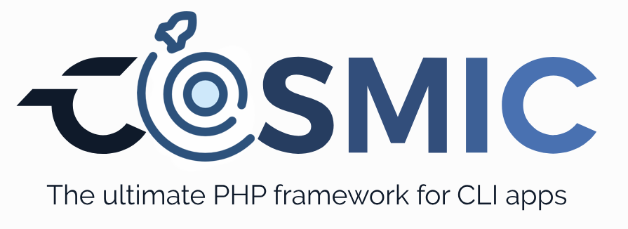

Cosmic is, in one hand a PHP framework for building CLI applications, and in the other hand a CLI application for generating PHP applications.

This is a work in progress, and it is not ready for production use. However, you can use it to build your own CLI applications. Help is needed to improve the project, so if you are interested in contributing, please read the [contributing guide](./docs/contributing.md). 

- 🛸 [Overview](./docs/overview.md)
- ✋ [Requirements](./docs/requirements.md)
- 🚀 [Features](./docs/features.md)
- 📦 [Installation](./docs/installation.md)
  - [Using Phive](./docs/installation.md#using-phive)
  - [GitHub releases](./docs/installation.md#github-releases)
  - [Building from source](./docs/installation.md#building-from-source)
- 🧰 [Basic usage](./docs/usage.md)
  - [Bundled Commands](./docs/usage.md#bundled-commands)
- 🥷 [Developer docs](./docs/dev/README.md)
- 🤝 [Contributing](./docs/contributing.md)
- 🙏 [Credits](./docs/credits.md)
